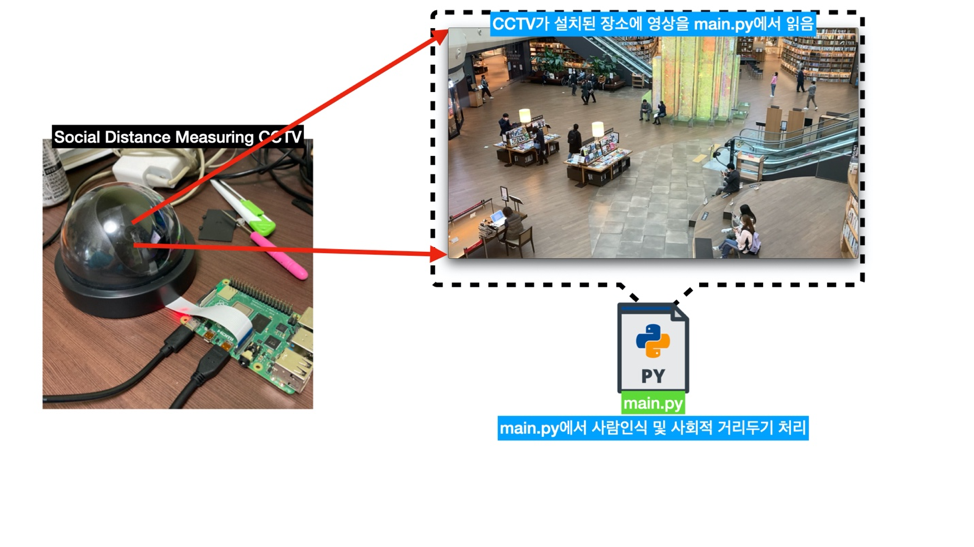
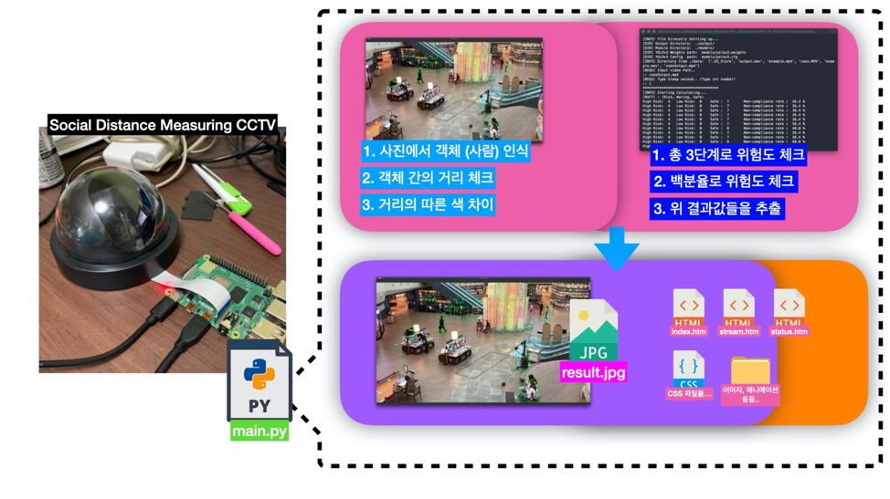
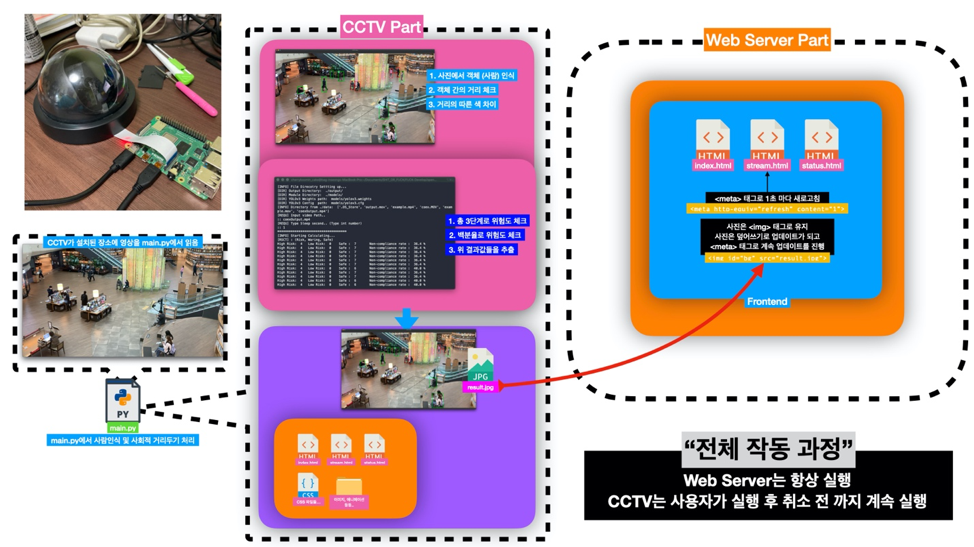
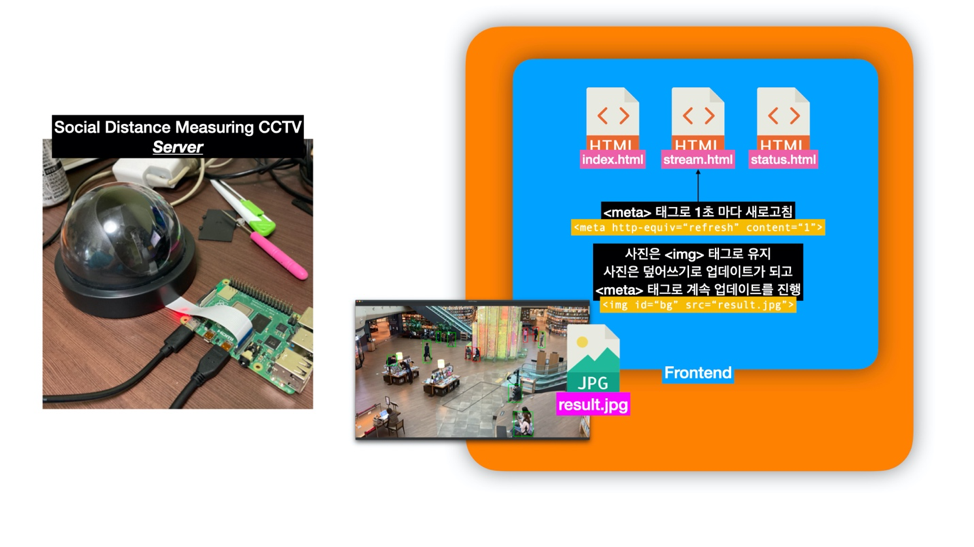
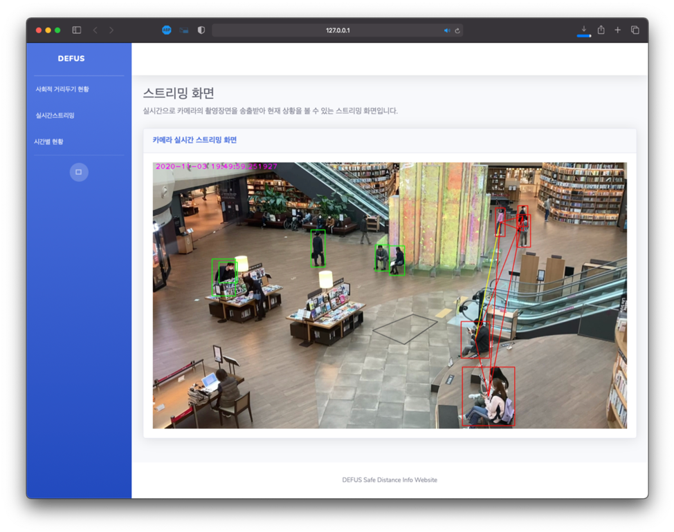
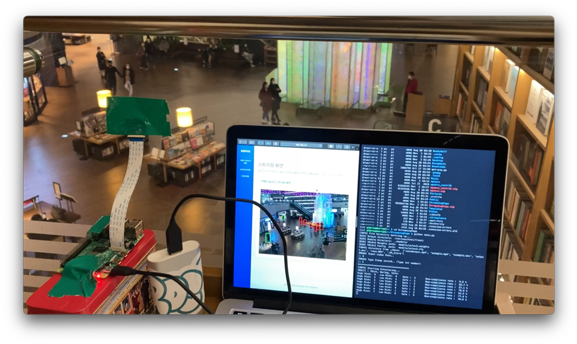

# social-distance
사회적 거리두기를 시각화 하며 측정을 하는 CCTV 프로젝트 이다. 사실 이게 선린인터넷고등학교 2020 IoT 경진대회 때문에 시작하게 된 프로젝트이다. 사실 리드미를 작성해보니 아마 보고서랑 거의 비슷하게 갈거 같긴 한듯. 

# What did I used it?
## macOS
<pre>
./Software
macOS Catlina (실제 개발 당시에는 카탈리나 였으나 지금은 Big sur)
Python 3.9
openCV 4.4.0

./Hardware
Facetime Webcam
Just my Macbook Pro (early, 2015)
</pre>

## Raspberry Pi
<pre>
./Software
Raspberry Pi OS
Python 3.7.2 (virtuelenv)
openCV 4.1.1 (virtuelenv)

./Hardware
Raspberry Pi Camera v2
</pre>

# Directory
가장 중요한 Python 파일 아래와 동일하다.
```python
main.py 
plot.py
utils.py
```
그리고 프론트 파일은 
```HTML
./Iot_Contest/frontend/
```
안에 모두 담아 두었다. 프론트 엔드 같은 경우는 경진대회에서 같이 진행 했던 민서가 모두 만들었다. <BR> 
<strong>SHOUT OUT TO M.S.</strong>

# 실행 순서도
말로 설명하기에는 너무나도 복잡한데 막상 보면 간단함. 이게 무슨 말인지는 직접 사진을 보시고 판단 해주시길... 




여기서 몇가지 전공적(?)인 내용을 추가 하자면 Human Detection 에서는 yolov3를 활용하였다. <a href="./models/yolov3.cfg"> ~~"폴더 안에 모델 있어요.."~~ </a>. main.py 에서 yolov3.cfg 모델을 활용하는데 plot.py 에서 화면 변환을 하고 좌표를 끌어 오고 Human Detection 이 되는 것이다.

# Final Result!


대회 전에 삼성동 별마당 도서관에서 테스트를 한 결과물이다. 

# 이 시국에 굳이 별마당?
이유는 진짜 간단하다. 조명 때문이다. <br> <br>
yolov3 의 모델은 훌륭한 모델이다. 진짜로. 굉장히 빠른 속도로 낮은 사양에서도 빠르게 Object Detection이 가능한 모델 이기 때문이다. 하지만 조명의 영향을 받는 것은 어쩔수 없는 사실이다. 컴퓨터 시각처리를 진행하면 어쩔수 없이 영향을 받게 되는 요소 중 하나이다. 실내에서는 항상 일정한 조명을 쏘기 때문에 그림자가 여러 방해 요소들이 확 줄어든다. 물론 별마당 도서관의 천장이 유리로 되어 있어서 뚫려 있기는 한다 하지만 그래도 일정 조명은 똑같은 조명이다. <br> <br> 

또한 이 프로젝트의 주 목표는 사회적 거리두기의 측정인 만큼 통풍이 잘 되지 않는 곳에서 코로나 확산은 실외보다 더더욱 심하다. 그렇기 때문에 별마당 도서관이 가장 적당하다고 판단을 하였다. 

